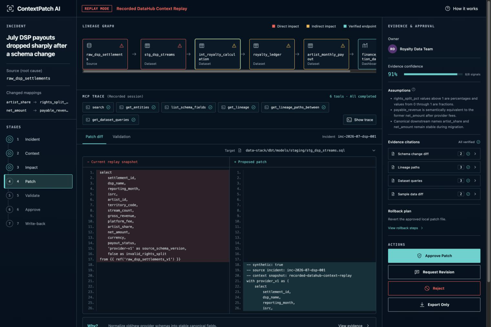
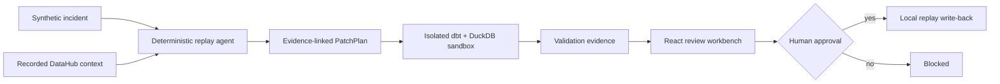

# ContextPatch AI

**Data context in. Production-ready patch out. Knowledge ready to write back.**

ContextPatch AI is a metadata-aware schema migration and data incident repair workbench. It uses DataHub-shaped schema, lineage, ownership, glossary, and query context to map upstream field changes, show the downstream blast radius, generate a constrained multi-file dbt patch, validate financial semantics, and require human approval before write-back.

> **Runs keyless:** the default **Recorded DataHub Context Replay** needs no account, API key, external API, Docker, or network. It is permanently labeled as replay and never claimed as a live DataHub session.

```bash
pnpm install --frozen-lockfile
pnpm dev
# open http://localhost:4173
```

The guided demo maps `artist_share → rights_split_pct` (including 0.65/65 unit normalization) and `net_amount → payable_revenue`, traces eight synthetic payout dependencies, generates eight reviewable files, and shows an actual isolated dbt/DuckDB validation result: **16 passed, 0 warned, 0 errored**.



The final interface was checked at 1536×1024 and 390×844. The generated concept and implementation fidelity notes remain under [`design/`](design).

- Live demo: **[Open the account-free replay](https://estona815.github.io/contextpatch-ai-datahub-2026/)**
- Demo video: **[Watch the 1:40 public captioned walkthrough](https://youtu.be/tT01wUpNsYM)**
- Source: **[github.com/estona815/contextpatch-ai-datahub-2026](https://github.com/estona815/contextpatch-ai-datahub-2026)**

Challenge: **Build with DataHub: The Agent Hackathon 2026**

## Why this exists

An upstream schema change is rarely just a rename. A new percentage unit can compile successfully while changing payouts; an apparently local staging fix can affect ledgers, exports, dashboards, owners, and audit artifacts. Generic code generation lacks the catalog evidence to know that blast radius.

ContextPatch links every step:

```text
recorded metadata evidence → schema mapping → bounded impact graph
→ structured PatchPlan → policy + fixture + dbt validation
→ human approval → local replay write-back record
```

## Why DataHub

The executed context ablation makes the dependency concrete:

| Context | Field mapping recall | Downstream asset recall | Patch files |
| --- | ---: | ---: | ---: |
| Incident only | 0/2 | 0/8 | 0/8 |
| Recorded schema only | 2/2 | 0/8 | 0/8 |
| Full recorded DataHub context | 2/2 | 8/8 | 8/8 |

Schema context finds the mapping; lineage, entities, ownership, and query context turn it into a complete repair plan. See [DATAHUB_USAGE.md](DATAHUB_USAGE.md) and [the ablation report](docs/15-context-ablation-report.md).

## Why an agent

The workflow combines ambiguous semantic mapping, graph traversal, code/test/contract generation, and evidence synthesis across multiple files. A deterministic provider keeps the public replay free and repeatable, while the agent contract makes every assumption, tool trace, file, command, validation, and approval machine-readable. The external-AI provider boundary is present but intentionally disabled in this keyless build.

## Demo flow

1. Inspect the synthetic incident and persistent Replay badge.
2. Expand six recorded MCP-shaped context traces.
3. Explore the eight-asset impact graph and three affected owners.
4. Review generated SQL, tests, contract, migration note, and diffs.
5. Compare old/new/mixed fixtures and the real dbt sandbox result.
6. Approve, reject, or request revision.
7. After approval, inspect a **local replay record**; no live DataHub mutation occurs.
8. Export the complete replay JSON.

## Generated artifacts

- Backward-compatible `stg_dsp_streams.sql`
- Canonical royalty calculation SQL
- dbt schema/range/uniqueness/reconciliation tests
- Versioned provider contract
- Migration and rollback notes
- Proposed and replay-approved patch files
- Impact, validation, write-back, evaluation, and ablation reports

Judge-readable outputs are under [`examples/`](examples). The replay JSON conforms to [`packages/schemas/contextpatch.schema.json`](packages/schemas/contextpatch.schema.json).

## Architecture



See [docs/04-architecture.md](docs/04-architecture.md) for boundaries and component detail.

## Modes

- **Replay (validated default):** static recorded DataHub-shaped context, deterministic provider, local-only approval/write-back, zero network.
- **Mock:** the same small deterministic fixtures used by unit tests.
- **Full (optional, not live-validated):** version-targeted DataHub OSS + MCP + PostgreSQL/dbt ingestion and approved mutations. Instructions are under [`infra/datahub/`](infra/datahub); Docker and credentials are required for this optional mode.

There is no silent fallback. `OpenAIProvider` fails closed and Replay Mode always discloses its provenance.

## Local setup

Requirements: Node.js 20+ (tested with 24.14), pnpm 11.9, and Python 3.9+; Python 3.12 is recommended for the pinned dbt environment.

### Web-only keyless demo

```bash
pnpm install --frozen-lockfile
pnpm dev
```

The browser app contains the recorded fixture and makes no API request.

### Agent, contracts, evaluation, and dbt sandbox

```bash
python3 -m venv .venv
.venv/bin/python -m pip install -e 'services/agent[dev]'

.venv/bin/contextpatch demo --repository-root . --output examples/reports/replay-outcome.json
.venv/bin/python scripts/evaluate/run_incident_suite.py --repository-root .
.venv/bin/python scripts/evaluate/run_context_ablation.py --repository-root .

.venv/bin/python scripts/demo/materialize_replay.py --repository-root .
# Save this repository path, then cd to the printed data-stack/dbt directory:
CONTEXTPATCH_ROOT="$(pwd)"
cd artifacts/runtime/<printed-run>/data-stack/dbt
"$CONTEXTPATCH_ROOT/.venv/bin/dbt" seed --profiles-dir . --full-refresh
"$CONTEXTPATCH_ROOT/.venv/bin/dbt" build --profiles-dir .
```

The materializer refuses to overwrite an existing sandbox and writes only under ignored `artifacts/runtime/` by default.

## Testing

```bash
.venv/bin/python -m unittest discover -s services/agent/tests -v
pnpm typecheck
pnpm lint
pnpm test
pnpm build
python3 contrib/datahub-skill/tests/test_structure.py
.venv/bin/python scripts/submission/scan_secrets.py --repository-root .
.venv/bin/python scripts/submission/audit_dependencies.py --repository-root .
```

Measured results and exact scope are documented in [docs/11-testing-strategy.md](docs/11-testing-strategy.md) and [`examples/reports/`](examples/reports). The replay output was also generated twice with the same SHA-256 (`6aa52d37…d212`). The 25-case evaluation covers deterministic routing/safety/fallback behavior; it does not claim 25 independently generated dbt patches.

## Environment variables

Replay Mode uses none. [`.env.example`](.env.example) lists optional Full Mode variables and contains no secret. Mutation is disabled by default.

## Security and approval

Metadata text is untrusted. Paths and commands are allowlisted, generated content is scanned, lineage traversal is bounded/cycle-safe, automated writes target a fresh sandbox, and local write-back requires a passing validation plus a patch-ID-matched approval. See [SECURITY.md](SECURITY.md) and [docs/10-security-threat-model.md](docs/10-security-threat-model.md).

## Honest limitations

No live DataHub server, ingestion, MCP handshake, DataHub mutation, external model, or upstream PR ran in the validated build. The hosted demo is the disclosed static replay, and its UI approval is demonstrative rather than a production authorization service. Full details are in [docs/20-known-limitations.md](docs/20-known-limitations.md).

## Disclosures and license

- New-work and related pre-existing-project disclosure: [docs/01-preexisting-work-disclosure.md](docs/01-preexisting-work-disclosure.md)
- AI assistance/runtime disclosure: [AI_DISCLOSURE.md](AI_DISCLOSURE.md)
- Third-party notices: [ATTRIBUTIONS.md](ATTRIBUTIONS.md), [THIRD_PARTY_NOTICES.md](THIRD_PARTY_NOTICES.md)
- License: [Apache License 2.0](LICENSE)

This repository, static replay, and captioned demo video were published on 2026-07-21. Devpost submission and any upstream contribution remain separately tracked actions.
