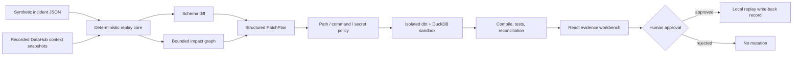

# Architecture

## Components

- `apps/web`: Vite/React single-page replay workbench. It imports a generated replay fixture and performs no network request.
- `services/agent/contextpatch`: standard-library deterministic analyzer, lineage traversal, policy engine, patch planner, validator, approval gate, and replay exporter.
- `data-stack`: synthetic CSV sources, dbt models/tests, and migration contract.
- `packages/schemas`: Draft 2020-12 contracts and TypeScript shapes.
- `examples`: recorded context, generated files, patches, reports, and evaluation evidence.
- `infra`: optional Full Mode recipes and a clearly labeled recorded MCP capability snapshot.

## Trust boundaries

Recorded metadata is untrusted data, not agent instruction. Generated content crosses a policy boundary before entering the sandbox. Validation results cross an approval boundary before local write-back. Replay Mode has no path to external systems.

## Deployment shape

The current artifact is a static public-demo candidate. The Python/dbt process is a local validation companion, not a hosted backend. Full Mode would introduce protected DataHub, MCP, database, and credentials boundaries and therefore requires a separate security review.
